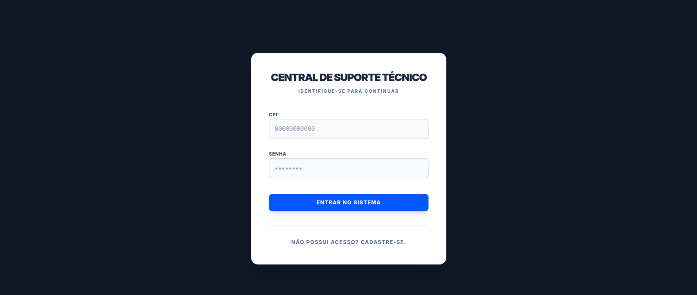
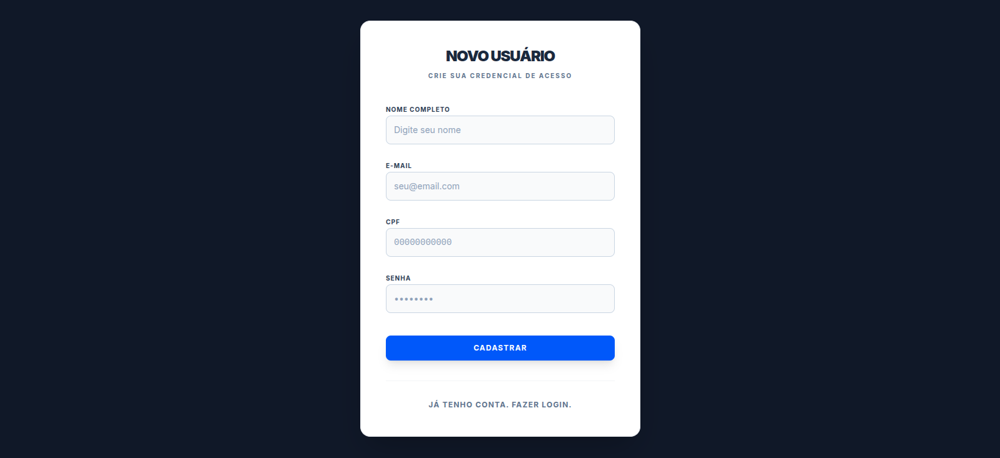
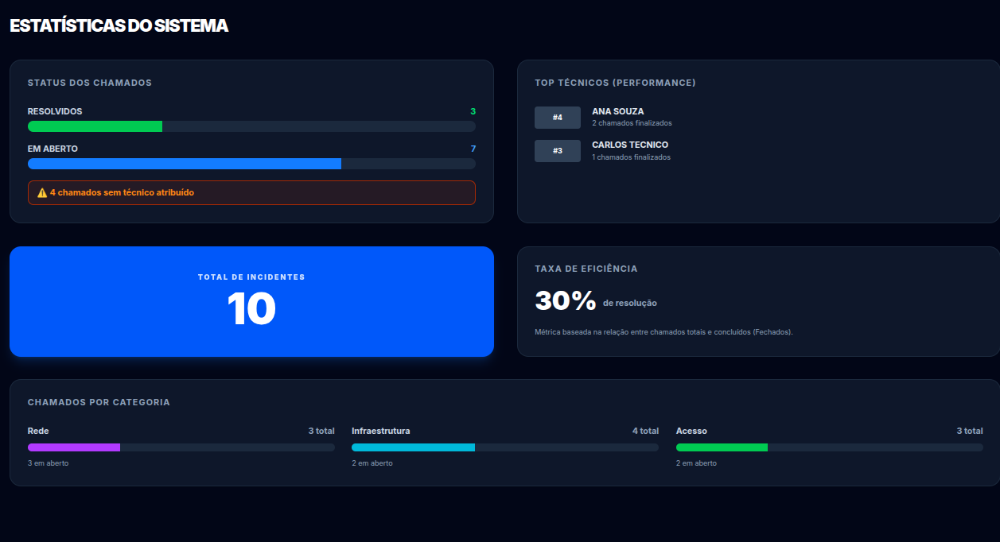
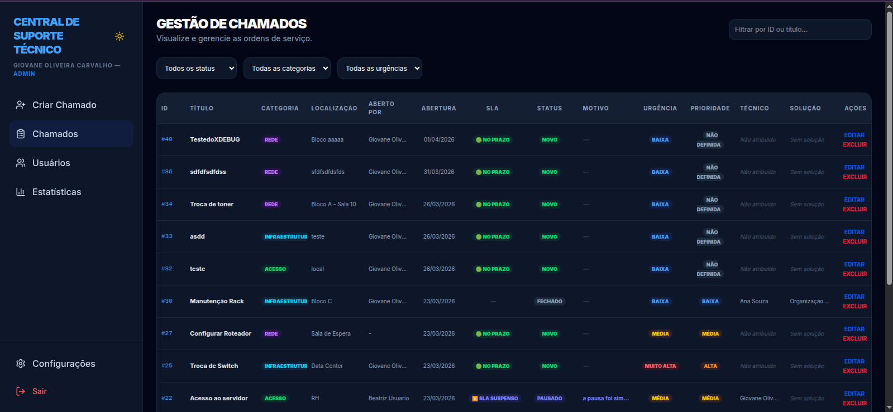
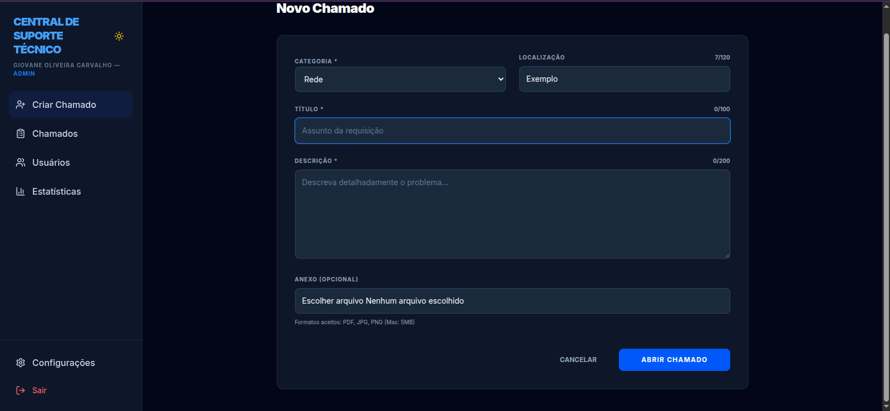
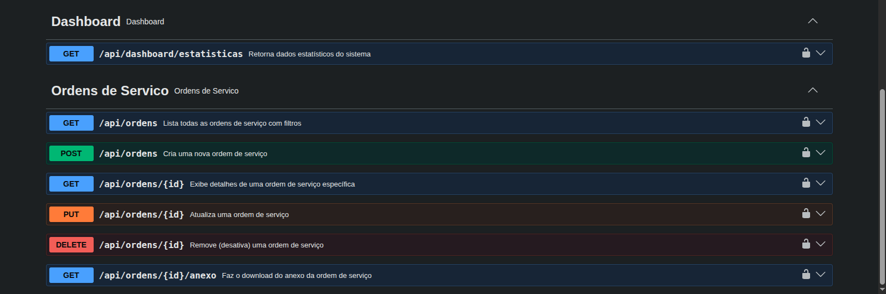
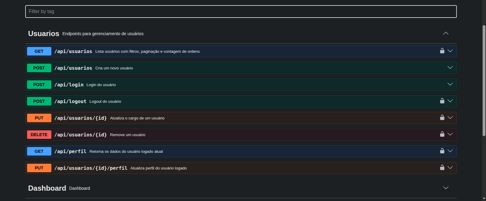

# OS Manager — Sistema de Gerenciamento de Ordens de Serviço

Plataforma integrada para gestão de chamados técnicos, com API REST em **Laravel** e interface em **Next.js**, totalmente containerizada via **Docker**. Inclui autenticação JWT, controle de acesso por cargo, fluxo completo de OS com cálculo de tempo de pausa, SLA e código de rastreio único por chamado.

> **Status:** em desenvolvimento ativo.

---

## Como rodar (do zero, em 1 comando)

**Pré-requisito:** Docker e Docker Compose instalados.

```bash
git clone https://github.com/giovanecarvalho-dev/sistema-ordens-servico.git
cd sistema-ordens-servico
# Para revisar a branch em desenvolvimento:
git checkout refactor_frontend

docker compose up --build
```

Só isso. No primeiro `up`, de forma automática:

- **O banco** sobe e carrega o schema + seeds (schemas `core`/`gestoes`, tabelas, metadata e um **admin padrão**) a partir de `backend/estrutura_banco.sql`. Isso acontece só quando o volume está vazio.
- **O backend** cria o `.env` a partir do `.env.example` e gera `APP_KEY` e `JWT_SECRET` sozinho.
- **O frontend** usa `http://localhost:8000/api` por padrão (não precisa de configuração).

Quando os três serviços subirem, acesse **http://localhost:3000** e entre com o admin padrão:

| Campo | Valor |
| --- | --- |
| **CPF** | `00000000000` |
| **Senha** | `password` |

> Para recriar o ambiente do zero (apaga todos os dados e recarrega o schema):
> ```bash
> docker compose down -v && docker compose up --build
> ```

### Acesso aos serviços

| Serviço | URL |
| --- | --- |
| Frontend | http://localhost:3000 |
| Backend API | http://localhost:8000 |
| Swagger (Docs) | http://localhost:8000/api/documentation |
| Banco de Dados | localhost:5432 |

---

## Demonstração

### Autenticação
**Login**


**Criar Usuário**


### Sistema
**Dashboard**


**Listagem de Chamados**


**Abertura de Chamado**


### API (Swagger)
**Swagger — Ordens**


**Swagger — Usuários**


---

## Stack

**Backend**
- PHP 8.4 + Laravel
- Autenticação JWT (`tymon/jwt-auth`)
- PostgreSQL 15 (schemas `core` e `gestoes`)
- Documentação OpenAPI/Swagger via attributes do PHP 8

**Frontend**
- Next.js (App Router) + TypeScript
- Tailwind CSS
- Arquitetura em camadas: `types` → `services` → `lib` → `hooks` → `components` → `page`

**Infraestrutura**
- Docker + Docker Compose
- Volume nomeado para persistência do Postgres
- Schema versionado em SQL (`backend/estrutura_banco.sql` + `backend/sql_updates/`) — **o projeto não usa migrations do Laravel**

---

## Arquitetura

Três serviços orquestrados via `docker-compose`:

- **Next.js** — Frontend (porta 3000)
- **Laravel** — API REST (porta 8000)
- **PostgreSQL** — Banco (porta 5432)

### Decisões técnicas

- **Autenticação JWT em vez de sessão**: API stateless, escalável horizontalmente e desacoplada do front. Cliente envia token no header `Authorization: Bearer`.
- **Front "burro" / backend dono da lógica**: cálculos e regras de negócio (SLA, estatísticas, permissões) ficam no backend; o front apenas exibe e reage. Ex.: o tempo restante de SLA vem pronto do model (`sla_tempo_restante`).
- **Middleware customizado por cargo (`cargo:Tecnico,Admin`)**: autorização aplicada na camada de rota, antes do controller.
- **Identificação dupla das OS (ID numérico + UUID `codigo_rastreio`)**: ID interno para joins; UUID público para rastreio sem expor a sequência do banco.
- **Senhas com bcrypt**: hashing padrão do Laravel.
- **Eager loading nos relacionamentos (`with([...])`)**: evita N+1 em listagens de OS.
- **Schema PostgreSQL separado** (`core`, `gestoes`): organização por domínio dentro do mesmo banco.

---

## Controle de acesso

| Cargo | Permissões |
| --- | --- |
| **Usuário** | Criar chamados próprios |
| **Técnico** | Criar chamados; visualizar e atualizar apenas os atribuídos a ele |
| **Admin** | Acesso total: gerenciar usuários, todos os chamados, dashboard |

Permissões aplicadas via middleware customizado nas rotas (`backend/routes/api.php`).

---

## Funcionalidades

- Autenticação JWT com login, logout, perfil e recuperação de senha por e-mail
- Cadastro público restrito ao cargo "Usuário" (sem escalada de privilégio)
- CRUD completo de Ordens de Serviço com filtros (status, categoria, urgência, prioridade, SLA, busca textual, ID e UUID)
- Paginação nativa e ordenação por data de criação
- Cálculo de SLA e de tempo pausado (estados "Pausado" / "Aguardando Peça") no backend
- Comentários e histórico por chamado; exportação CSV
- Dashboard de estatísticas acionável (drill-down)
- Notificações por usuário
- Documentação interativa via Swagger UI
- Health check em `/api/health`

---

## Estrutura do projeto

    .
    ├── backend/                 # API Laravel
    │   ├── app/
    │   │   ├── Http/
    │   │   │   ├── Controllers/
    │   │   │   ├── Middleware/   # autorização por cargo
    │   │   │   └── Requests/     # validação (Form Requests)
    │   │   └── Models/
    │   ├── routes/api.php
    │   ├── estrutura_banco.sql   # schema + seeds (fonte da verdade do banco)
    │   ├── sql_updates/          # alterações incrementais de schema
    │   └── entrypoint.sh         # setup automático (.env, chaves) no boot
    ├── frontend/                # Next.js (App Router)
    │   └── app/
    │       ├── types/  services/  lib/  hooks/  components/   # camadas
    │       └── <rota>/page.tsx
    ├── docs/screenshots/
    └── docker-compose.yml
